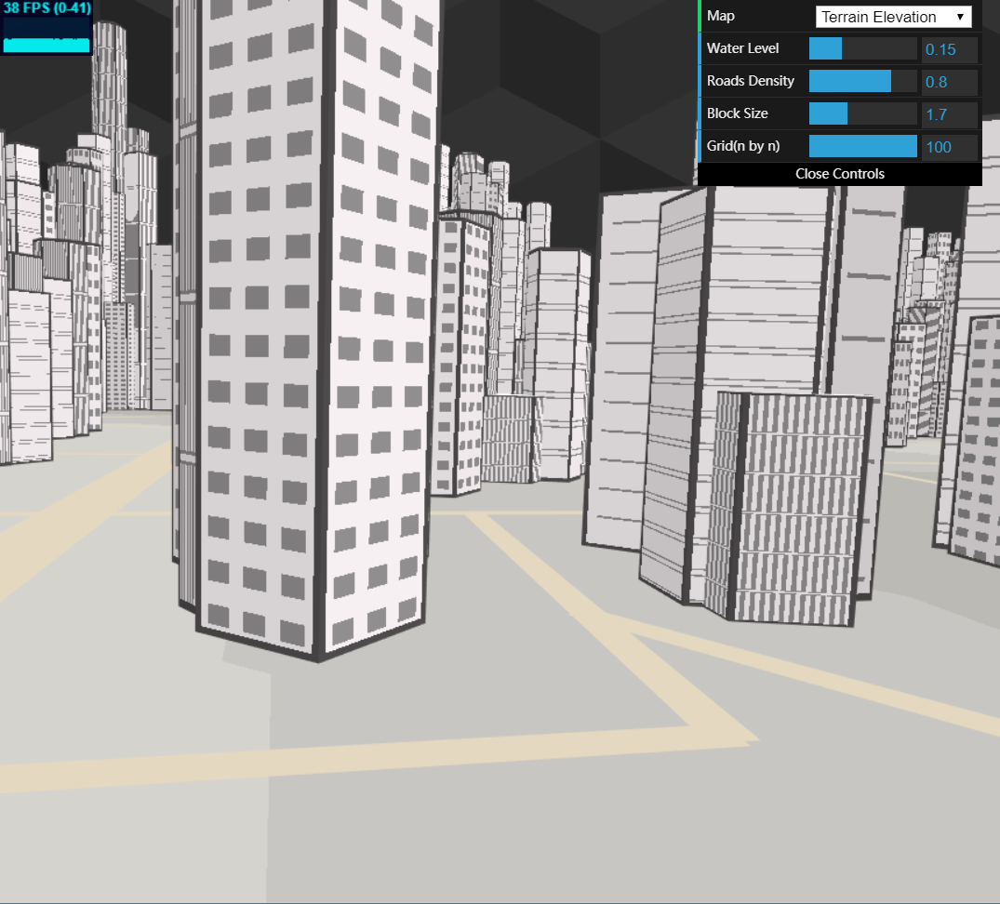

# CIS 566 Homework 6: City Generation

## ID
 - __Name:__ Jiangping Xu
 - __PennKey:__ xjp

Demo
---------
https://haco77.github.io/hw06-city-generation/

Implementation Details
----------
- Building Locations: I divide the terrain into a high resolution 2D grid ("Grid" option in the control panel). For each cell I check the distance from its nearest road. If the value is greater than a threshold and no water in this cell, I label the cell as available to place buildings. The threshold is related to the road width and the cell size. After determining all cells, I randomly scatter points on the terrain. I create buildings at points which lie in the available cells.

- Building Generation: I write a class called poly to create vbos of a regular polygon with arbitrary number of sides. At each point from last step, I place a random polygon and extrude it downward to the ground. The height of the building is related to the population density at that point. Higher density results in higher buildings. I randomly place another lower polygon at the center of a random vertex of the last polygon, and repeat this process up to two times.

- Procedural Texture: I calculate the texture of buildings based on uv coordinates. I designed 4 kinds of texture, inspired by city sketch. All the textures are generated by manipulating uv coordinates with mod(). The key step is to normalize the width of lines according to the heights of the buildings.

- Procedural Background: Because my scene is not a realist style, I choose to create a modern geometry instead of sky as the background. There is a repeating pattern in the background, so I use mod() again on the uv coordinates. The rest is math calculation to determine the face that the current uv lies on.

- Light: I add three directional lights and an environment light to the scene, using lambert law for shading.

Scene Shot
---------
